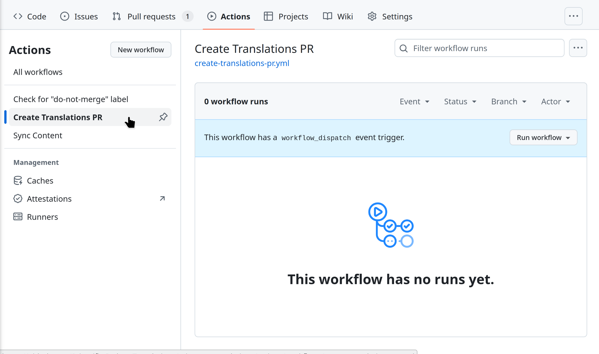
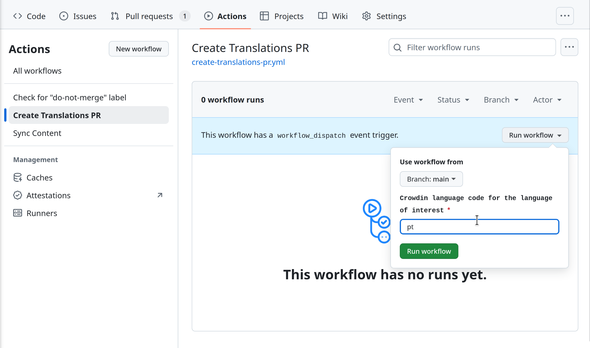
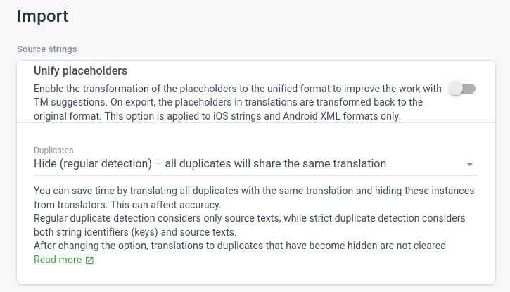

This page details existing patterns for setting up and deploying translations
for project websites. As each project has their own set up, the patterns
described here may not fit exactly, but they will help you understand the
basic workflows.

At least some of the tasks described here rely on scripts from
https://github.com/Scientific-Python-Translations/automations/.

<!-- separate actual steps maintainers need to take from internal crowdin implementation details -->

## Integration with Crowdin

[Crowdin](https://scientific-python.crowdin.com/) provides GitHub integration
tools to sync all translated content from the Crowdin web interface into project
websites and vice-versa. However, a few adaptations are needed. The following
steps describe what maintainers need to do to set up the integration. See  for more details on this script.

### Setting up Crowdin

Create a Crowdin project for your repository and turn on synchronization
between Crowdin and your source repo. If you planning on using the
[Scientific Python Crowdin workspace](https://scientific-python.crowdin.com/),
please reach out to the
[Scientific Python translations team on discord](https://discord.com/invite/vur45CbwMz)
for help. For more information, see
[Crowdin's documentation](https://support.crowdin.com/enterprise/github-integration/).

To prevent extra activity in the original source repository, we recommend
creating a separate repository for the translations under
https://github.com/scientific-python-translations with a GitHub action to sync
the translations to the original repository (see
[sync.yml](https://github.com/Scientific-Python-Translations/scipy.org-translations/blob/main/.github/workflows/sync.yml)
for an example). 

### Announce your project to potential translators

After your project is set up, you will have to add translators as members to
your Crowdin project so they can start translating. The general best practice is
to have two people per language (one translator, one reviewer) to ensure the
quality of the translations. However, your translations will not be published
until you approve them, so you can start with one translator and add a reviewer
later.

You can find potential translators by reaching out in the `#translation` channel
on the [Scientific Python Discord server](https://discord.com/invite/vur45CbwMz).

### Merging translations

As translators work on the Crowdin platform, a Pull Request is automatically
created in the project repository. This PR **should not** be merged, as it
contains all translations for all languages (see
[numpy/numpy.org#778](https://github.com/numpy/numpy.org/pull/778) for an
example). If your website is set up through the Scientific Python Translations
org, this PR will have the `do-not-merge` label applied to it.

After translations for a language are completed and ready to be deployed, you
should:

1. Go to the repository corresponding to your project's sources under
   https://github.com/Scientific-Python-Translations
2. Go to the Actions tab
3. Manually trigger the "Create translations PR" workflow, with the language
   code for your language of interest as input.

After these steps, a PR will be created to your website repo with the
translations for the language you selected (see
[numpy/numpy.org#774](https://github.com/numpy/numpy.org/pull/774) for an example.) This PR should be
merged when you are ready to publish the translations.

### Cleaning up

After merging the translations PR, the Crowdin service branch (by default, named `l10n_main`) will have merge conflicts with `main`. To fix this, delete the Crowdin service branch. Crowdin will automatically recreate the service branch with merge conflicts resolved. This same process can also be used to resolve merge conflicts if translations are updated outside of Crowdin.

## Automation details

Once a GitHub repository has been synced to Crowdin using the Scientific Python
set up, the
[`create_branch_for_language.sh` script](https://github.com/Scientific-Python-Translations/automations/blob/main/scripts/create_branch_for_language.sh)
is used to create a new branch including all (and only) commits from Crowdin's
branch for a particular language of interest. This script is useful because:

1. Crowdin will keep commits for all the available languages under translation
   in the same branch. However, we prefer to be able to create pull requests for
   one language at a time to keep Pull Request reviews smaller and easier to manage.

2. There are times when translations must be edited manually (outside of
   Crowdin) due to incorrect segmentation of the content into strings for
   translation. Crowdin's branch can only be edited through the Crowdin UI, and
   commits pushed to it outside of Crowdin will be lost when the branch is
   synced. By creating a new branch with only the commits we are interested in,
   we can bypass this limitation.

Ideally you will **not** have to run the `create_branch_for_language.sh` script
directly, but can include it as part of your website deployment process (see,
for example, [numpy/numpy.org#772](https://github.com/numpy/numpy.org/pull/772))


To prevent future conflicts with the GitHub/Crowdin integration, it is important
that you configure Crowdin to have duplicate strings share the same translation.
To do this, navigate to your project's Settings in Crowdin, select Import and under
"Source strings" -> "Duplicates" choose "Hide (regular detection)".



## Setting up a language switcher

This work is in progress - follow (issue #) for details.

### Scientific Python Hugo Theme

### PyData Sphinx Theme

This work is in progress - follow [pydata/pydata-sphinx-theme#507](https://github.com/pydata/pydata-sphinx-theme/issues/507) for details.

## Known limitations

### Missing translations

Translations may not always be up to date for items such as news items and
release announcements. In this case, your project can decide what to do with
these items (for example, keep them in English or hide them from the deployed
site.)